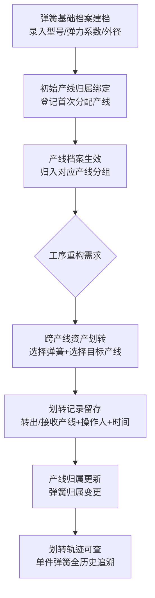

## 1. 产品概述

装配机标准弹簧产线归属划转管理系统，为零部件装配车间提供小件档案管理服务，核心跟踪弹簧所属生产产线的划转记录。系统专注于资产归属主体变更与历史轨迹查询，不涉及货架绑定、设备配套、状态标记等功能。

- 主要用途：实现弹簧资产在不同生产产线间的划转登记与全生命周期轨迹追溯
- 目标用户：车间管理员、产线调度员、资产管理员
- 目标价值：提升车间资产流转透明度，准确追踪每件弹簧的产线归属历史，为工序重构提供数据支撑

## 2. 核心功能

### 2.1 用户角色

| 角色 | 登记方式 | 核心权限 |
|------|----------|----------|
| 车间管理员 | 系统账号登录 | 弹簧档案建档、产线归属绑定、跨产线划转、历史溯源查询 |

### 2.2 功能模块

1. **弹簧档案管理页**：弹簧基础信息录入、初始产线绑定、档案列表展示
2. **产线划转操作页**：单条/批量划转操作、划转记录登记
3. **划转轨迹查询页**：单件弹簧全历史产线变更记录查询、按产线维度汇总

### 2.3 页面详情

| 页面名称 | 模块名称 | 功能描述 |
|-----------|----------|-------------|
| 弹簧档案管理 | 档案列表 | 产线分组自适应表格，展示全部弹簧基础信息及当前归属产线 |
| 弹簧档案管理 | 档案建档 | 录入型号、弹力系数、外径尺寸参数，绑定初始归属产线 |
| 产线划转操作 | 批量划转组件 | 选择多个弹簧，执行跨产线资产划转，记录转出产线、接收产线、操作人、操作时间 |
| 划转轨迹查询 | 历史轨迹 | 筛选单件弹簧全部过往产线变更记录，时间线展示 |
| 划转轨迹查询 | 产线汇总 | 按产线维度汇总该产线当前全部弹簧档案列表 |

## 3. 核心流程

弹簧从建档到划转的完整业务流程：

核心操作流程：

## 4. 用户界面设计

### 4.1 设计风格

**设计定位：工业极简风格，突出专业感与功能性

- **主色调**：工业蓝 `#1e40af`，代表精密制造领域的专业感
- **辅助色**：橙黄色 `#f59e0b`，用于操作按钮与状态强调
- **中性色**：深灰 `#1f2937` 作为文本，浅灰 `#f3f4f6` 作为背景
- **按钮风格**：直角轻微圆角（4px），工业感强，点击有下沉阴影效果
- **字体**：
  - 标题：`Noto Sans SC`，粗体，清晰有力
  - 正文：`JetBrains Mono`，等宽字体，数字对齐感强
- **布局风格**：顶部导航栏 + 左侧产线树 + 右侧内容区的经典工业控制台布局
- **图标风格**：线性图标，工业设备感，避免卡通风格

### 4.2 页面设计概览

| 页面名称 | 模块名称 | UI元素 |
|-----------|----------|--------|
| 弹簧档案管理 | 产线分组表格 | 左侧产线树形导航，右侧按产线分组展示弹簧列表，行悬停高亮，选中行有侧边指示条 |
| 弹簧档案管理 | 建档表单 | 卡片式表单，左侧标签右对齐输入框，工业感表单控件 |
| 产线划转操作 | 批量划转组件 | 弹窗式组件，双列表穿梭框设计，左侧待划转弹簧列表，右侧目标产线选择，底部操作按钮组 |
| 划转轨迹查询 | 历史时间线 | 垂直时间线，每个节点包含产线信息、操作人、时间、操作类型 |
| 划转轨迹查询 | 产线汇总卡 | 产线卡片网格，展示产线名称、弹簧数量统计、最近划转时间 |

### 4.3 响应式设计

- **桌面端优先**：主内容区最小宽度 1280px
- **产线树**：固定宽度 240px，可折叠收起
- **表格**：横向滚动自适应，列宽可拖拽调整
- **移动端**：简化为顶部标签切换产线，表格简化展示关键信息

### 4.4 动效设计

- 页面加载：产线列表从左到右渐入，表格行错峰淡入
- 划转操作：成功后弹簧行从原产线组"滑入"新产线组
- 时间线：节点按时间倒序依次展开
- 悬停效果：表格行背景色微变，按钮有轻微上浮阴影
