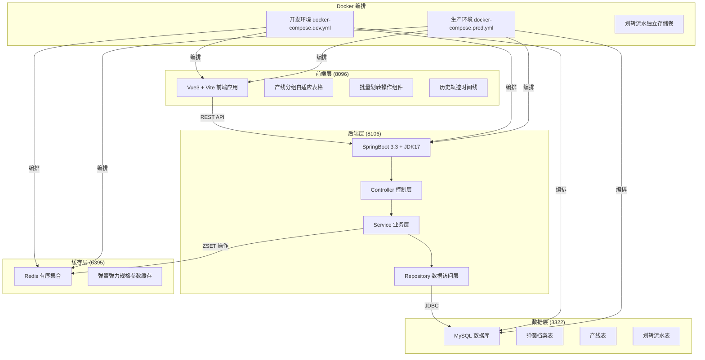
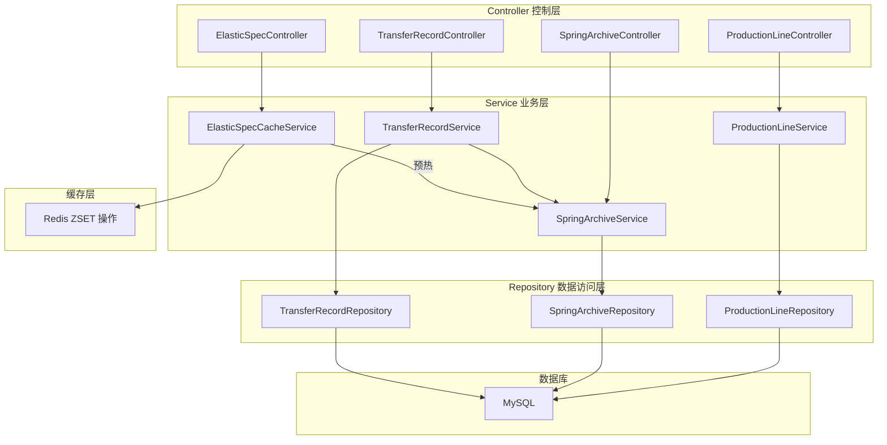
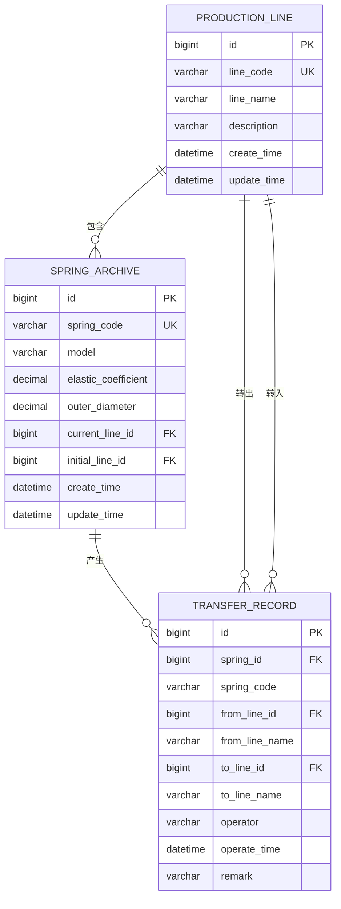

## 1. 整体架构设计

系统采用前后端分离架构，前端负责页面交互与数据展示，后端负责业务逻辑与数据持久化，Redis 作为缓存层存储高频访问的弹簧规格参数。



## 2. 技术栈说明

### 2.1 前端技术栈
- **框架**：Vue 3.4.21 + TypeScript 5.4.2
- **构建工具**：Vite 5.2.0
- **路由**：Vue Router 4.3.0
- **状态管理**：Pinia 2.1.7
- **UI 组件库**：Element Plus 2.6.3
- **HTTP 客户端**：Axios 1.6.7
- **样式方案**：Tailwind CSS 3.4.1
- **NPM 镜像**：中科大镜像 `https://registry.npmmirror.com`

### 2.2 后端技术栈
- **框架**：Spring Boot 3.3.0
- **JDK 版本**：OpenJDK 17
- **ORM 框架**：Spring Data JPA + Hibernate 6.4
- **数据库连接池**：HikariCP 5.1.0
- **Redis 客户端**：Lettuce 6.3.2
- **API 文档**：SpringDoc OpenAPI 2.5.0
- **Maven 镜像**：网易开源镜像 `https://maven.163.com/repository/public`

### 2.3 基础设施
- **数据库**：MySQL 8.0.36，端口 3322
- **缓存**：Redis 7.2.4，端口 6395
- **容器化**：Docker 26.0 + Docker Compose 2.26
- **数据卷**：划转流水表独立挂载，持久化存储

## 3. 前端路由定义

| 路由路径 | 页面名称 | 功能说明 |
|---------|----------|----------|
| `/` | 弹簧档案管理 | 产线分组展示弹簧列表，支持新增档案 |
| `/transfer` | 产线划转操作 | 批量划转操作页面 |
| `/trace` | 划转轨迹查询 | 单件弹簧历史轨迹 + 产线汇总查询 |

## 4. API 接口定义

### 4.1 通用响应结构

```typescript
interface ApiResponse<T> {
  code: number;
  message: string;
  data: T;
  timestamp: number;
}
```

### 4.2 数据实体定义

```typescript
// 生产产线
interface ProductionLine {
  id: number;
  lineCode: string;
  lineName: string;
  description: string;
  haltStatus?: 'NORMAL' | 'HALTED';  // 临时停台状态
  haltReason?: string;              // 停台原因
  haltExpectedResumeTime?: string;  // 预计复台时间
  haltOperator?: string;            // 停台操作人（调度员）
  haltTime?: string;
  resumeOperator?: string;          // 复台操作人
  resumeTime?: string;
  resumeConclusion?: string;        // 复台结论（必填）
  createTime: string;
}

// 弹簧档案
interface SpringArchive {
  id: number;
  springCode: string;
  model: string;
  elasticCoefficient: number;
  outerDiameter: number;
  currentLineId: number;
  currentLineName: string;
  initialLineId: number;
  createTime: string;
  updateTime: string;
}

// 划转流水记录
interface TransferRecord {
  id: number;
  springId: number;
  springCode: string;
  fromLineId: number;
  fromLineName: string;
  toLineId: number;
  toLineName: string;
  operator: string;
  operateTime: string;
  remark: string;
}

// 划转申请提交请求
interface SubmitApplicationRequest {
  springIds: number[];
  toLineId: number;
  applicant: string;  // 申请人
  reason: string;     // 申请原因
}

// 审批请求（驳回时 reason 必填）
interface ApprovalRequest {
  itemIds: number[];
  approver: string;
  reason?: string;
}
```

### 4.3 接口清单

| HTTP方法 | 路径 | 功能说明 | 请求参数 | 响应数据 |
|---------|------|----------|----------|----------|
| GET | `/api/lines` | 获取所有产线列表 | - | `ProductionLine[]` |
| GET | `/api/lines/{id}` | 获取单个产线详情 | path: id | `ProductionLine` |
| POST | `/api/lines` | 新增产线 | body: ProductionLine | `ProductionLine` |
| GET | `/api/lines/{id}/halt-guard` | 登记停台前影响提示（停台状态+流向该产线的待审批申请量） | path: id | `LineHaltGuardResponse` |
| POST | `/api/lines/{id}/halt` | 调度员登记临时停台（停台原因+预计复台时间） | body: LineHaltRequest | `ProductionLine` |
| POST | `/api/lines/{id}/resume` | 产线复台（复台结论必填） | body: LineResumeRequest | `ProductionLine` |
| GET | `/api/springs` | 分页查询弹簧档案 | query: page, size, lineId, keyword | `Page<SpringArchive>` |
| GET | `/api/springs/group-by-line` | 按产线分组弹簧列表 | - | `Map<number, SpringArchive[]>` |
| GET | `/api/springs/{id}` | 获取单个弹簧详情 | path: id | `SpringArchive` |
| POST | `/api/springs` | 新增弹簧档案 | body: SpringArchive | `SpringArchive` |
| GET | `/api/springs/{id}/trace` | 查询弹簧划转轨迹 | path: id | `TransferRecord[]` |
| GET | `/api/transfers` | 分页查询划转流水 | query: page, size, springId, lineId | `Page<TransferRecord>` |
| POST | `/api/transfer-applications` | 提交划转申请（记录申请原因/申请人/时间） | body: SubmitApplicationRequest | `TransferApplication` |
| GET | `/api/transfer-applications` | 分页查询划转申请 | query: page, size, status, halted(目标产线是否停台), keyword | `Page<TransferApplication>` |
| GET | `/api/transfer-applications/{id}` | 申请详情（弹簧明细+审批状态+操作记录） | path: id | `ApplicationDetailResponse` |
| POST | `/api/transfer-applications/approve` | 逐条/批量审批通过（通过后更新归属并生成流水） | body: ApprovalRequest | `ItemProcessResult[]` |
| POST | `/api/transfer-applications/reject` | 逐条/批量驳回（驳回原因必填） | body: ApprovalRequest | `ItemProcessResult[]` |
| GET | `/api/specs/elastic-force` | 从Redis获取弹力规格参数 | query: min, max | `List<Double>` |

## 5. 后端架构分层



## 6. 数据模型设计

### 6.1 ER 实体关系图



### 6.2 DDL 数据定义语句

```sql
-- 产线表
CREATE TABLE production_line (
    id BIGINT PRIMARY KEY AUTO_INCREMENT COMMENT '主键ID',
    line_code VARCHAR(32) NOT NULL UNIQUE COMMENT '产线编码',
    line_name VARCHAR(64) NOT NULL COMMENT '产线名称',
    description VARCHAR(255) COMMENT '产线描述',
    create_time DATETIME NOT NULL DEFAULT CURRENT_TIMESTAMP COMMENT '创建时间',
    update_time DATETIME NOT NULL DEFAULT CURRENT_TIMESTAMP ON UPDATE CURRENT_TIMESTAMP COMMENT '更新时间',
    INDEX idx_line_code (line_code)
) ENGINE=InnoDB DEFAULT CHARSET=utf8mb4 COLLATE=utf8mb4_unicode_ci COMMENT='生产产线表';

-- 弹簧档案表
CREATE TABLE spring_archive (
    id BIGINT PRIMARY KEY AUTO_INCREMENT COMMENT '主键ID',
    spring_code VARCHAR(32) NOT NULL UNIQUE COMMENT '弹簧编号',
    model VARCHAR(64) NOT NULL COMMENT '弹簧型号',
    elastic_coefficient DECIMAL(10,4) NOT NULL COMMENT '弹力系数 N/mm',
    outer_diameter DECIMAL(10,4) NOT NULL COMMENT '外径尺寸 mm',
    current_line_id BIGINT NOT NULL COMMENT '当前归属产线ID',
    initial_line_id BIGINT NOT NULL COMMENT '初始归属产线ID',
    seal_status VARCHAR(16) NOT NULL DEFAULT 'NONE' COMMENT '封存状态：NONE-正常 SEALED-封存中',
    seal_reason VARCHAR(255) COMMENT '封存原因（抽检不合格/待复测等）',
    seal_expected_unseal_date DATE COMMENT '预计解封日期',
    seal_operator VARCHAR(32) COMMENT '封存操作人（质量员）',
    seal_time DATETIME COMMENT '封存时间',
    unseal_operator VARCHAR(32) COMMENT '解封操作人',
    unseal_time DATETIME COMMENT '解封时间',
    unseal_conclusion VARCHAR(255) COMMENT '解封结论（复测结果/处置结论）',
    create_time DATETIME NOT NULL DEFAULT CURRENT_TIMESTAMP COMMENT '创建时间',
    update_time DATETIME NOT NULL DEFAULT CURRENT_TIMESTAMP ON UPDATE CURRENT_TIMESTAMP COMMENT '更新时间',
    INDEX idx_spring_code (spring_code),
    INDEX idx_current_line (current_line_id),
    INDEX idx_seal_status (seal_status),
    FOREIGN KEY (current_line_id) REFERENCES production_line(id),
    FOREIGN KEY (initial_line_id) REFERENCES production_line(id)
) ENGINE=InnoDB DEFAULT CHARSET=utf8mb4 COLLATE=utf8mb4_unicode_ci COMMENT='弹簧档案表';

-- 划转流水表（独立表空间）
CREATE TABLE transfer_record (
    id BIGINT PRIMARY KEY AUTO_INCREMENT COMMENT '主键ID',
    spring_id BIGINT NOT NULL COMMENT '弹簧ID',
    spring_code VARCHAR(32) NOT NULL COMMENT '弹簧编号',
    from_line_id BIGINT NOT NULL COMMENT '转出产线ID',
    from_line_name VARCHAR(64) NOT NULL COMMENT '转出产线名称',
    to_line_id BIGINT NOT NULL COMMENT '接收产线ID',
    to_line_name VARCHAR(64) NOT NULL COMMENT '接收产线名称',
    operator VARCHAR(32) NOT NULL COMMENT '操作人',
    operate_time DATETIME NOT NULL DEFAULT CURRENT_TIMESTAMP COMMENT '操作时间',
    remark VARCHAR(255) COMMENT '划转备注',
    INDEX idx_spring_id (spring_id),
    INDEX idx_operate_time (operate_time),
    INDEX idx_from_line (from_line_id),
    INDEX idx_to_line (to_line_id),
    FOREIGN KEY (spring_id) REFERENCES spring_archive(id),
    FOREIGN KEY (from_line_id) REFERENCES production_line(id),
    FOREIGN KEY (to_line_id) REFERENCES production_line(id)
) ENGINE=InnoDB DEFAULT CHARSET=utf8mb4 COLLATE=utf8mb4_unicode_ci COMMENT='划转流水记录表'
DATA DIRECTORY='/var/lib/mysql/transfer_data';

-- 初始化产线数据
INSERT INTO production_line (line_code, line_name, description) VALUES
('LINE-001', '装配一号线', '精密小型件装配线'),
('LINE-002', '装配二号线', '中型件标准装配线'),
('LINE-003', '装配三号线', '大型件重载装配线'),
('LINE-004', '装配四号线', '自动化智能装配线');
```

### 6.3 Redis 数据结构设计

**Key**: `spring:elastic:specs`  
**类型**: ZSET (有序集合)  
**用途**: 缓存所有弹簧的弹力系数规格，支持按范围快速查询

```
ZADD spring:elastic:specs 0.5 "0.5000"
ZADD spring:elastic:specs 1.2 "1.2000"
ZADD spring:elastic:specs 2.5 "2.5000"
ZADD spring:elastic:specs 3.8 "3.8000"
ZADD spring:elastic:specs 5.0 "5.0000"

# 按范围查询
ZRANGEBYSCORE spring:elastic:specs 1.0 4.0
```

**预热时机**：应用启动时从数据库读取所有弹簧弹力系数写入 Redis，新增/修改弹簧时同步更新。

## 7. Docker Compose 配置说明

### 7.1 目录结构
```
/
├── docker-compose.dev.yml      # 开发环境配置
├── docker-compose.prod.yml     # 生产环境配置
├── frontend/
│   ├── Dockerfile
│   └── .dockerignore
├── backend/
│   ├── Dockerfile
│   └── .dockerignore
└── docker/
    ├── mysql/
    │   └── init/
    │       └── schema.sql
    └── volumes/
        ├── mysql-data/         # MySQL 数据卷
        ├── transfer-data/      # 划转流水独立卷
        └── redis-data/         # Redis 数据卷
```

### 7.2 开发环境特性
- 前端挂载源码目录，支持热更新
- 后端启用 debug 端口 5005
- MySQL 映射 3322 端口到宿主机
- Redis 映射 6395 端口到宿主机
- 日志级别 DEBUG

### 7.3 生产环境特性
- 前后端多阶段构建，镜像最小化
- 数据库端口不对外暴露
- 划转流水使用独立存储卷
- 资源限制（CPU/Memory）
- 健康检查配置
- 日志级别 INFO
- 重启策略 always
